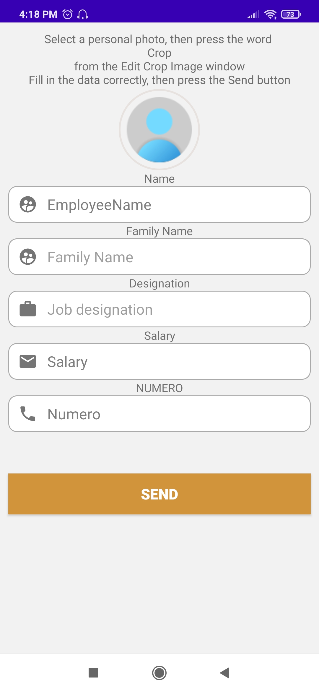

# Employee-management-system-in-Android
 
this repo present a multi-language mobile application which consists in managing a list of employees via an SQLite database.

## Tech used
* Java
* Xml 
* SQLite

## Screenshots

---

1  |  2 
:-------------------------:|:-------------------------:
 | 

---

  3 | 4
:-------------------------:|:-------------------------:
 | 

---

  5 | 6
:-------------------------:|:-------------------------:
 | 

---

  7 | 8 | 9
:-------------------------:|:-------------------------:|:-------------------------:
 |  | 
